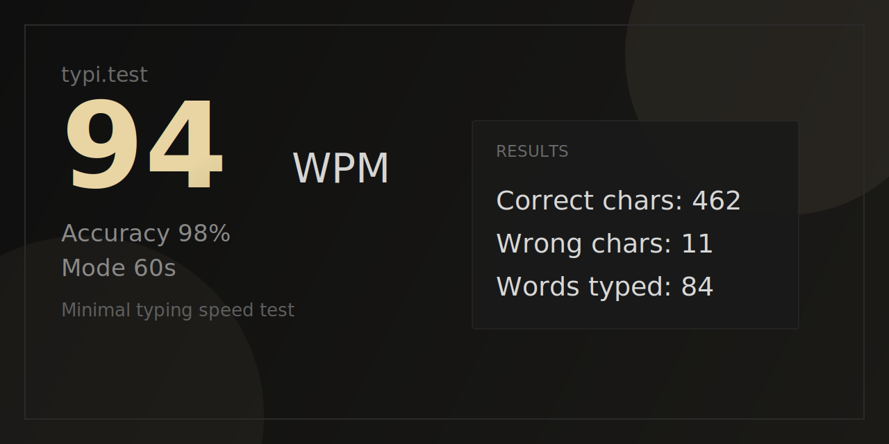

# typi

<p align="center">
  
</p>

<p align="center">
  <strong>A minimal, fast, and distraction-free typing speed test.</strong><br>
  Track your WPM and accuracy in real time, then share your results as an image.
</p>

<p align="center">
  
  
  
</p>

## Why typi?

typi is built to feel focused and responsive.

- Real-time stats for `WPM`, `accuracy`, and remaining time
- Time modes: `15s`, `30s`, `60s`
- Clean word flow with cursor tracking and smooth line progression
- Results screen with detailed breakdown:
  - correct chars
  - wrong chars
  - words typed
- Share-ready score image generation (`download image` and native `share image` when supported)
- Zero dependencies, runs from a single `index.html`

## Quick Start

1. Clone the repository.
2. Open `index.html` in your browser.

Or run a local server:

```bash
python3 -m http.server 8080
```

Then visit `http://localhost:8080`.

## Project Structure

- `index.html` - app UI, styling, and typing logic
- `robots.txt` - crawler directives

## Tech

- Semantic HTML
- Modern CSS
- Vanilla JavaScript
- Canvas API for score-card image export
- Web Share API fallback handling

## Roadmap

- Persist personal best scores locally
- Add more word-list difficulty profiles
- Optional account + leaderboard mode

## License

Choose a license for this repository (MIT is a common choice).
# typi
